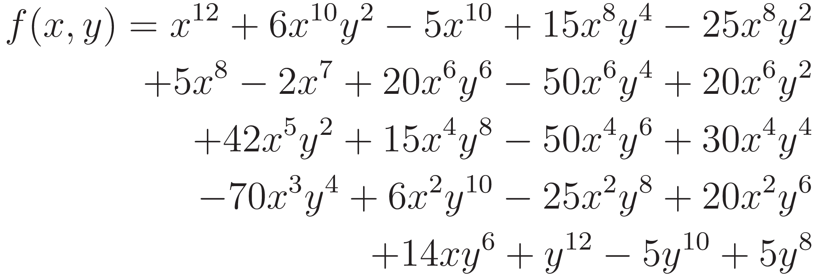

# Haskell Shading Language Representation

I have been wanting to make a functional shading language for almost a year, since I started learning Haskell. Here it is

```haskell
{-# LANGUAGE ExtendedDefaultRules #-}

module Main where
import SyntaxTree
import Language
import Compiler
import Optimizer
import Runtime
import Control.Monad (when)
import Prelude hiding (cos,sin,length,(.))
import qualified Prelude (length)

uv = var Vector2 "uv"
time = var Float "u_time"
cos = cosine
sin = sine

normOccilation = 0.5 * (sin time) + 0.5

colorf l = 0.5 + (0.5 * ( cos $ 3.1415 + (l * 0.15) + vector (0.0,0.6,1.0) ))

biasPlane = smoothstep r (r+s) z
    where z = root $ (uv.x * uv.x) + (uv.y * uv.y)
          r = 0.2 + (normOccilation * 0.2) + (0.2 * perlin (uv + time)) + (0.2 * perlin (uv + time + 10.0))
          s = 0.02

yellow = vector (0.988,0.729,0.0117)
white = vector (1,1,1)

program = mix yellow white biasPlane
    where white = colorf (time * 5)

main = do
    let programOutput = generateProgram $ flattenAssociativeOperations $ optimize program
    when (Prelude.length programOutput > 0) $ writeFile "out.glsl" programOutput
```

Optimized output
```c#
#include "lib/runtime.glsl"
#include "lib/noise.glsl"
void program(inout vec3 color) { 
	float _cache_0x1 = sin(u_time);
	float _cache_0x2 = (uv . y);
	float _cache_0x3 = perlin((uv + u_time));
	vec2 _cache_0x4 = (10.0 + uv + u_time);
	float _cache_0x5 = perlin(_cache_0x4);
	float _cache_0x6 = (_cache_0x2 * _cache_0x2);
	float _cache_0x7 = (0.2 * _cache_0x5);
	float _cache_0x8 = (0.2 + (((0.5 * _cache_0x1) + 0.5) * 0.2));
	float _cache_0x9 = (((uv . x) * (uv . x)) + _cache_0x6);
	float _cache_0xa = (_cache_0x8 + (0.2 * _cache_0x3));
	float _cache_0xb = (_cache_0xa + _cache_0x7);
	
	color = mix(vec3(0.988, 0.729, 1.17e-2), (0.5 + (0.5 * cos((vec3(0.0, 0.6, 1.0) + 3.1415 + (0.15 * u_time * 5.0))))), smoothstep(_cache_0xb, (_cache_0xb + 2.0e-2), sqrt(_cache_0x9)));
}
```
Regular output
```c#
#include "lib/runtime.glsl"
#include "lib/noise.glsl"
void program(inout vec3 color) { 
	color = mix(vec3(0.988, 0.729, 1.17e-2), (0.5 + (0.5 * cos((vec3(0.0, 0.6, 1.0) + 3.1415 + (0.15 * u_time * 5.0))))), smoothstep(((0.2 * perlin((10.0 + uv + u_time))) + (0.2 * perlin((uv + u_time))) + 0.2 + (((0.5 * sin(u_time)) + 0.5) * 0.2)), (2.0e-2 + (0.2 * perlin((10.0 + uv + u_time))) + (0.2 * perlin((uv + u_time))) + 0.2 + (((0.5 * sin(u_time)) + 0.5) * 0.2)), sqrt((((uv . x) * (uv . x)) + ((uv . y) * (uv . y))))));
}
```

### Example of optimization

Obtaining a shape by slicing the distance function 

is done by 
```haskell
color = var Float "color"
uv = (var Vector2 "uv") - vector (0.5,0.5)
time = var Float "u_time"
cos = cosine
sin = sine

slice f r s = smoothstep r (r+s) f

distanceField x y = x^12 + 6*x^10* y^2 - 5*x^10 + 15*x^8 * y^4 - 25*x^8*y^2 + 5*x^8 - 2*x^7 + 20*x^6* y^6 - 50*x^6*y^4 + 20*x^6* y^2 + 42*x^5* y^2 + 15*x^4*y^8 - 50*x^4* y^6 + 30*x^4* y^4 - 70*x^3* y^4 + 6*x^2* y^10 - 25*x^2* y^8 + 20*x^2* y^6 + 14*x* y^6 + y^12 - 5*y^10 + 5*y^8

yellow = vector (0.988,0.729,0.0117)
white = vector (1,1,1)

program = mix yellow white $ slice (distanceField (pos.x) (pos.y)) (sin time) 0.01
    where pos = uv * 10
```
which produces the shader program
```c#
void program(inout vec3 color) { 
	color = mix(vec3(0.988, 0.729, 1.17e-2), vec3(1.0, 1.0, 1.0), smoothstep(sin(u_time), (sin(u_time) + 1.0e-2), (((pow((((uv - vec2(0.5, 0.5)) * 10.0) . y), 12.0) + (pow((((uv - vec2(0.5, 0.5)) * 10.0) . y), 6.0) * 14.0 * (((uv - vec2(0.5, 0.5)) * 10.0) . x)) + (((((((pow((((uv - vec2(0.5, 0.5)) * 10.0) . y), 8.0) * 15.0 * pow((((uv - vec2(0.5, 0.5)) * 10.0) . x), 4.0)) + (pow((((uv - vec2(0.5, 0.5)) * 10.0) . y), 2.0) * 42.0 * pow((((uv - vec2(0.5, 0.5)) * 10.0) . x), 5.0)) + ((((((((pow((((uv - vec2(0.5, 0.5)) * 10.0) . x), 12.0) + (pow((((uv - vec2(0.5, 0.5)) * 10.0) . y), 2.0) * 6.0 * pow((((uv - vec2(0.5, 0.5)) * 10.0) . x), 10.0))) - (5.0 * pow((((uv - vec2(0.5, 0.5)) * 10.0) . x), 10.0))) + (pow((((uv - vec2(0.5, 0.5)) * 10.0) . y), 4.0) * 15.0 * pow((((uv - vec2(0.5, 0.5)) * 10.0) . x), 8.0))) - (pow((((uv - vec2(0.5, 0.5)) * 10.0) . y), 2.0) * 25.0 * pow((((uv - vec2(0.5, 0.5)) * 10.0) . x), 8.0))) + (5.0 * pow((((uv - vec2(0.5, 0.5)) * 10.0) . x), 8.0))) - (2.0 * pow((((uv - vec2(0.5, 0.5)) * 10.0) . x), 7.0))) + (pow((((uv - vec2(0.5, 0.5)) * 10.0) . y), 6.0) * 20.0 * pow((((uv - vec2(0.5, 0.5)) * 10.0) . x), 6.0))) - (pow((((uv - vec2(0.5, 0.5)) * 10.0) . y), 4.0) * 50.0 * pow((((uv - vec2(0.5, 0.5)) * 10.0) . x), 6.0))) + (pow((((uv - vec2(0.5, 0.5)) * 10.0) . y), 2.0) * 20.0 * pow((((uv - vec2(0.5, 0.5)) * 10.0) . x), 6.0))) - (pow((((uv - vec2(0.5, 0.5)) * 10.0) . y), 6.0) * 50.0 * pow((((uv - vec2(0.5, 0.5)) * 10.0) . x), 4.0))) + (pow((((uv - vec2(0.5, 0.5)) * 10.0) . y), 4.0) * 30.0 * pow((((uv - vec2(0.5, 0.5)) * 10.0) . x), 4.0))) - (pow((((uv - vec2(0.5, 0.5)) * 10.0) . y), 4.0) * 70.0 * pow((((uv - vec2(0.5, 0.5)) * 10.0) . x), 3.0))) + (pow((((uv - vec2(0.5, 0.5)) * 10.0) . y), 10.0) * 6.0 * pow((((uv - vec2(0.5, 0.5)) * 10.0) . x), 2.0))) - (pow((((uv - vec2(0.5, 0.5)) * 10.0) . y), 8.0) * 25.0 * pow((((uv - vec2(0.5, 0.5)) * 10.0) . x), 2.0))) + (pow((((uv - vec2(0.5, 0.5)) * 10.0) . y), 6.0) * 20.0 * pow((((uv - vec2(0.5, 0.5)) * 10.0) . x), 2.0))) - (5.0 * pow((((uv - vec2(0.5, 0.5)) * 10.0) . y), 10.0))) + (5.0 * pow((((uv - vec2(0.5, 0.5)) * 10.0) . y), 8.0)))));
}
```
This program is unnecessarily slow and contains may redundant expressions. The repetitive expressions such as `(uv - vec2(0.5, 0.5)) * 10` can have their value saved via a variable assignment. 
```c#
void program(inout vec3 color) { 
	float _cache_0x1 = sin(u_time);
	vec2 _cache_0x2 = vec2(0.5, 0.5);
	float _cache_0x3 = (_cache_0x1 + 1.0e-2);
	vec2 _cache_0x4 = (uv - _cache_0x2);
	vec2 _cache_0x5 = (_cache_0x4 * 10.0);
	float _cache_0x6 = (_cache_0x5 . y);
	float _cache_0x7 = pow(_cache_0x6, 8.0);
	float _cache_0x8 = (5.0 * _cache_0x7);
	float _cache_0x9 = (pow(_cache_0x6, 6.0) * 20.0 * pow((_cache_0x5 . x), 2.0));
	
	color = mix(vec3(0.988, 0.729, 1.17e-2), vec3(1.0, 1.0, 1.0), smoothstep(_cache_0x1, _cache_0x3, (((pow(_cache_0x6, 12.0) + (pow(_cache_0x6, 6.0) * 14.0 * (_cache_0x5 . x)) + (((((((_cache_0x7 * 15.0 * pow((_cache_0x5 . x), 4.0)) + (pow(_cache_0x6, 2.0) * 42.0 * pow((_cache_0x5 . x), 5.0)) + ((((((((pow((_cache_0x5 . x), 12.0) + (pow(_cache_0x6, 2.0) * 6.0 * pow((_cache_0x5 . x), 10.0))) - (5.0 * pow((_cache_0x5 . x), 10.0))) + (pow(_cache_0x6, 4.0) * 15.0 * pow((_cache_0x5 . x), 8.0))) - (pow(_cache_0x6, 2.0) * 25.0 * pow((_cache_0x5 . x), 8.0))) + (5.0 * pow((_cache_0x5 . x), 8.0))) - (2.0 * pow((_cache_0x5 . x), 7.0))) + (pow(_cache_0x6, 6.0) * 20.0 * pow((_cache_0x5 . x), 6.0))) - (pow(_cache_0x6, 4.0) * 50.0 * pow((_cache_0x5 . x), 6.0))) + (pow(_cache_0x6, 2.0) * 20.0 * pow((_cache_0x5 . x), 6.0))) - (pow(_cache_0x6, 6.0) * 50.0 * pow((_cache_0x5 . x), 4.0))) + (pow(_cache_0x6, 4.0) * 30.0 * pow((_cache_0x5 . x), 4.0))) - (pow(_cache_0x6, 4.0) * 70.0 * pow((_cache_0x5 . x), 3.0))) + (pow(_cache_0x6, 10.0) * 6.0 * pow((_cache_0x5 . x), 2.0))) - (_cache_0x7 * 25.0 * pow((_cache_0x5 . x), 2.0))) + _cache_0x9) - (5.0 * pow(_cache_0x6, 10.0))) + _cache_0x8)));
}
```
This example can be found in `Example.hs`.